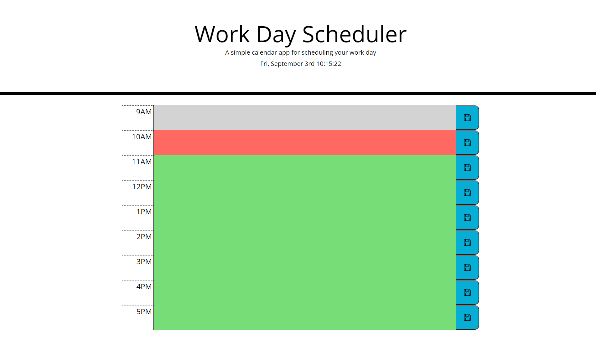
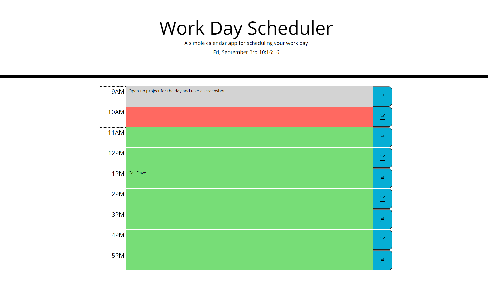

# Homework Week 5

The goal of this homework assignment was to create a calender application that allows users to save events for each hour of the day. The text area background color is supposed to allow the user to quickly see which block the current time is, what times have alread passed and what times are still avaliable in the current day. The application is supposed to save the text entered in the textarea to local storage and then render that text back upon a reload. 

## Usage

The application is fairly simple to use. The clock at the top is the current time and the color of the text box adjacent to the time slot indicates whether that current time has passed(grey), is present(red), or in the future(green). After the day is over all blocks will stay grey until the next work day begins. When the user enters text into a text area they must click a save button. The save button pressed does not need to be the button adjacent to the text however, since all data is stored in the same array all save buttons execute the same function. The one downfall to the design of this app is it has no way to quickly remove all local storage at once. I intended to apply this functionality originally but thought it could cause more damage than good (ie, accidently clearing your entire schedule accidently with no way to recover the data). 

## Screenshots

## Links

[Link to deployed application via Github pages](https://zmoore371.github.io/Homework-Week-5/)

[Link to Github repository](https://github.com/zmoore371/Homework-Week-5)